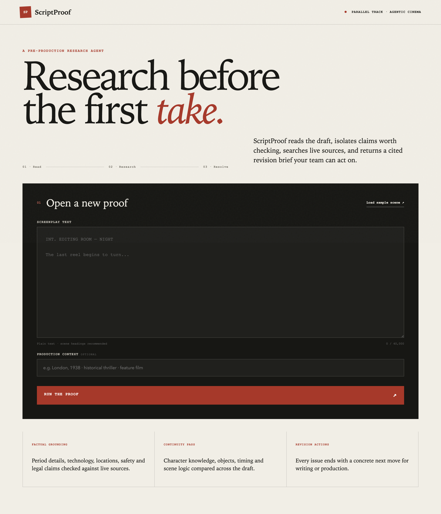
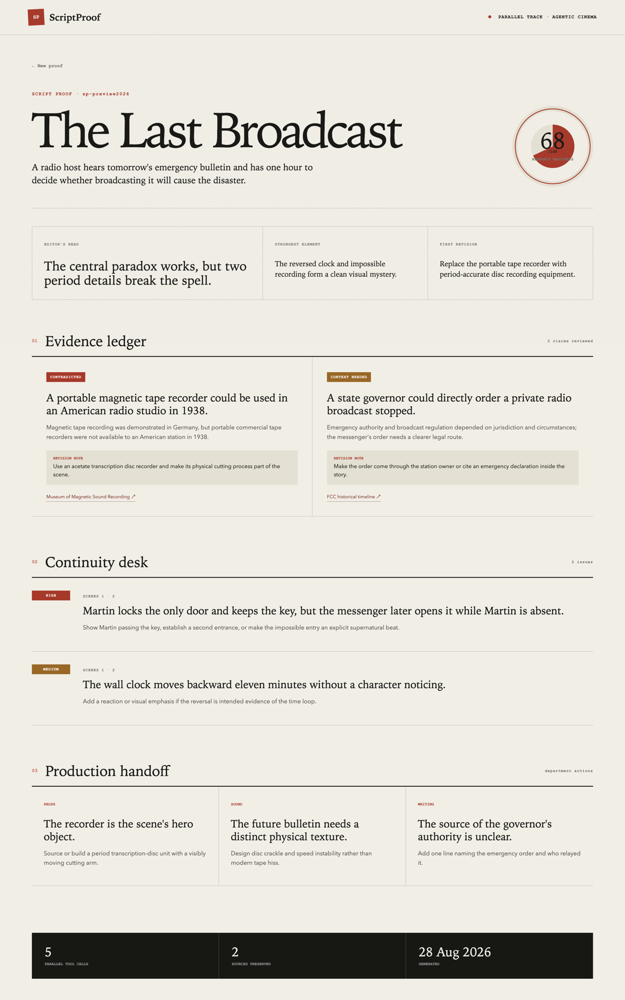

<p align="center"><a href="README.md">English</a> | <b>简体中文</b></p>

<h1 align="center">ScriptProof</h1>

<p align="center">
  <b>开拍之前，先把事实查清楚。</b><br>
  剧本研究 · 证据账本 · 连续性检查 · 制片交接
</p>

<p align="center">
  <a href="#产品能力">产品能力</a> ·
  <a href="#工作流程">工作流程</a> ·
  <a href="#本地运行">本地运行</a> ·
  <a href="docs/COMPETITION_RULES.md">比赛约束</a>
</p>

---



## 产品能力

ScriptProof 把剧本草稿转化为一份带出处、可以直接交给编剧和制片团队的研究报告。它不是普通聊天机器人，也不会默认重写故事。

- 找出会影响年代准确性、安全、法律可信度、地点真实性和技术细节的关键事实。
- 通过 Parallel 实时搜索并保留可复核的来源链接。
- 标记得到支持、与资料矛盾、证据不足或需要更多上下文的陈述。
- 对照不同场景，发现人物知识、道具、时间和出入口等连续性问题。
- 为编剧、道具、服装、场景、声音、法律和安全部门生成具体修改动作。



## 工作流程

```text
剧本文本 + 制作背景
        ↓
剧本分析 Agent：提取待核查事实和连续性候选
        ↓
证据研究 Agent：调用 Parallel 搜索并生成引用
        ↓
故事编辑 Agent：输出结构化修改与制片交接报告
```

三个 Agent 由 Google ADK 编排，模型使用 Gemini 3.5 Flash。Parallel 官方 `parallel-google-adk` 包提供搜索、网页提取和调用追踪。报告返回前，系统会确认待研究事实确实触发过 Parallel 调用，并逐条核对公开引用是否来自 Parallel 工具的真实返回。

系统还设有确定性的来源质量门：低权威来源会在故事编辑 Agent 读取之前被移除；如果删除后没有足够证据，原本确定性的结论会自动降级为“证据不足”。故事编辑 Agent 只接收受控的结构化状态和经过清理、限长的制作背景，不继承前序 Agent 的原始对话。

## 本地运行

需要 Python 3.12、已启用 Vertex AI 的 Google Cloud 项目，以及 Parallel API Key。

```bash
cp .env.example .env
uv sync --extra dev
gcloud auth application-default login
uv run python main.py
```

该启动入口不会使用 Flask CLI 向上搜索 `.env`，因此嵌套目录不会误读父项目密钥。

测试：

```bash
uv run ruff check .
uv run pytest --cov=scriptproof --cov-report=term-missing -q
```

当前验证结果为 47 项测试通过、覆盖率 89.00%。线上版本已部署至 [Cloud Run](https://scriptproof-web-388088752401.asia-southeast1.run.app/)，付费分析入口使用评审访问码保护。

## 比赛

ScriptProof 已提交至 [Agentic Cinema](https://agentic-cinema.devpost.com/) 的 Parallel 赛道。AI 与 Agent 能力只使用 Google Cloud，Parallel Search 在生产流程中被真实调用。

- [Devpost 参赛页](https://devpost.com/software/scriptproof)
- [线上项目](https://scriptproof-web-388088752401.asia-southeast1.run.app/)
- [2 分 17 秒公开演示](https://youtu.be/hyHVu464XAM)

## 免责声明

ScriptProof 是研究与编辑辅助工具，不替代法律、安全、历史或制片专业判断。开拍前应由对应部门负责人复核来源与结论。

## 赞赏

<p align="center">
  <a href="https://buymeacoffee.com/simonlin1212"></a>
</p>

## License

MIT License，详见 [LICENSE](LICENSE)。版本记录见 [CHANGELOG.md](CHANGELOG.md)。

**作者：** Simon 林 · X [@linsizhen](https://x.com/linsizhen) · 邮箱：[simonlin0423@gmail.com](mailto:simonlin0423@gmail.com)
